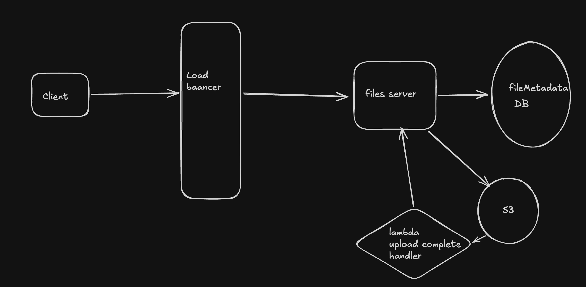
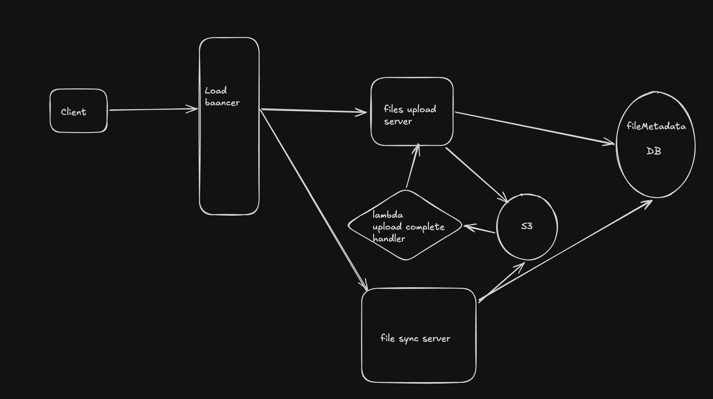

## Problem 
    Dropbox is a cloud-based file storage service that allows users to store and 
    share files. It provides a secure and reliable way to store and access files 
    from anywhere, on any device
## Functional Requirement : 
    1. Users should be able to upload a file from any device
    2. Users should be able to download a file from any device
    3. Users should be able to share a file with other users and view the files shared 
        with them
    4. Users can automatically sync files across devices
    
    --Skiping
    - User Auth and user management

## Core Entities
    - File
        {
            id - Varchar
            name - Varchar
            size - bytes long
            Path - BlobStore Path
            uploadStatus- Pending
            created - long
        }

## API
    - POST api/v1/file
        Request - 
        {
            name- 
        }
        
        response
        {
            id - Varchar
            presignedUrl - url
        }

    - GET api/v1/file/{fileId}
        Request - 
        {
            presignedUrl - url
        }
    
## Flow
    1. Client put a file which dropbox is looking then dropbox client get know
        new file is there upload based on OS Watch file facility.
    2. dropbox client ask server for presigned URL to upload file using  POST api/v1/file.
        server create the metasata and provides presigned URL
    3. once client upload the file S3 notifies file server reagrsing complete of upload
        server get that event through lambda and mark the upload complete
    4. user ask client to url it give a sharable to client based on fileId
    

## Basic HLD

## Deep dives
    1. How to handles large file upload ?
    - Chunking - Dropbox client should chunk file in smaller segment like 10 MB. and
                client each can be uploaded parellaly.

                File
                {
                    id - Varchar
                    name - Varchar
                    size - bytes long
                    Path - BlobStore Path
                    uploadStatus- Pending
                    created - long
                }

                Segment
                {
                    id - Varchar
                    fileId- FK
                    chunkSeq - int
                    size - bytes long
                    Path - BlobStore Path
                    uploadStatus- Pending
                    created - long
                }
    2. How to file changes ? should we upload entire files
        Hashing of file content. id of each segment can become hash of file content.
        and we will track content changes with this hash so we only needs to upload segment
        for whcih content changed.

    3. How will FileSync work ?
        - Client Device1 upload the file to server if client and another device with dropbox
            then that device should get the file
        - Once Device1 completes the upload . Device2 can peridically ask server if anything 
            changed via Polling (SSE/websocket as changes are not frequent)
        - client can download only segements which changed.

## Final HLD
        

    

    