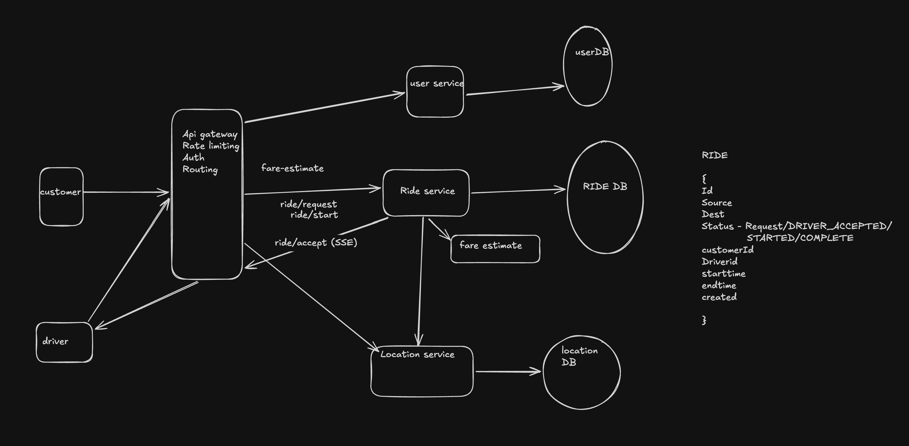

## Problem
Uber is a ride-sharing platform that connects passengers with drivers who offer
transportation services in personal vehicles. It allows users to book rides on-demand 
from their smartphones, matching them with a nearby driver who will take them from their 
location to their desired destination.

## Functional Requirements
1. Customer should be able to see estimate fare for selected source and destination
2. Customer should be able to book a Ride and complete it

## out of Scope
1. different kind of car handling
2. 

## Non-Functional requirements
1. Consistency in matching driver to customer means only one driver should be assigned to 
   customer.
2. Low latency in matching below 1 minute
3. Availability for other parts of System.

## Flow
- customer opens app adds source destination and ask for fare estimate for RIDE
- customer confirm fare and request RIDE
- Driver accepts ride request goes to customer location
- customer gives the OTP and Ride starts
- Reach destination and completes the ride

## Core entities :
    - Customer
    - Location
    - Driver
    - Ride

## Api's
    Post api/location // will be used for updating location of customer|driver
        {
        lat
        long
        }
    POST api/ride/fare-estimate // customer make this
        {
            source location
            dest location
        }
        
    POST api/ride/{rideId}/request // customer make this .this can have user location/ cartype 
        

    POST api/ride/{ride}/accept // driver should accept
        
    POST api/ride/complete // driver should complete

## HLD

## Deep dives
1. Fare Estimation : we can use some third party service like google map to get the distance
   and congestion . also Uber this service can include multiple parameter like number of driver
   available can give ride estimate
2. Ride db - we do not complex relation and queries based on that so can use Dynamo db
               partitioned by RideId
               We can have GIS USerId , DriverId
3. Location db - we can user postgres with postGIS to support redius quries but location
                writes could go  like 100K . postgres can not handle that much.
               we can use redis geoHash and can batch write like for 10 sec. it will reduce
               writes. client can intelligenty detect if user/Driver is moving or not and 
               can reduce the frequency if user is not moving

        