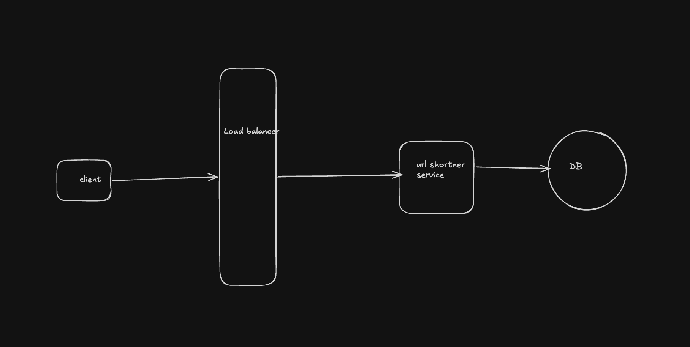

## Core Requirements
    1. Users should be able to submit a long URL and receive a shortened version.
        - Optionally, users should be able to specify a custom alias for their shortened URL (ie. "www.short.ly/my-custom-alias")
        - Optionally, users should be able to specify an expiration date for their shortened URL.
    2. Users should be able to access the original URL by using the shortened URL.

## Scale -
    1. 100 million daily active user
    2. 10 billion url in lifetime
    2. Read-write ratio : 1:10000 -> Read heavy 

## Core entities
    - URL
        {
            LongUrl     - Varchar(500)
            shortUrl    - Varchar(7) PK (Unique) HashIndex near O(1) lookup
            createdAt   - epochseconds
            expiryTime  - epochseconds
        }
    - For simiplicity we are skipping user and auth related part

## Api Endpoints 
    - POST api/urls
            Request - 
                {
                    longUrl - ""
                    expireDate - timestamp
                }
            Response - 
                {
                    shortUrl :
                }
    - GET api/urls/{shortUrl}
            Response - redirect to corresponding long url
            http code 301(permanent redirect means browser/CDN can cache and 
            redirect next request from same client without sending the request 
            to the server. we will on analytics/Logging) , 302 temp redirect we should 
            this one to server analytics.

## Basic HLD
    
    
    
    Steps : 
        1. Client makes a call to url shortner service. it creates a short URL and save this
            DB. returns shortURL in response
        2. Client hit short url. Url shortner service receives the request. lookup the DB for
            long URL then redirect on long URL 302.

## Deep dives
    1. How generate short url
        - We can generate a random number between 1-10 billion and encode it to base 62 
            roughly, 7 char short fits 3600 billion url so this fulfills our requirements
            But problem 
                - lookup in DB to see this Url already exists
            
    2. Handling 100K write/sec
        - Although, strorage required is roughly - 1 KB per recors * 10 billion - 1 TB
            we can can easy handle by memory optimized RDS insstance. but write through put
            is the issue so we will use dynamo DB as our queries are simple 
            - Insert
            - get based on short url
            partition key - shortUrl
            sort key - time
    3. 1 million read/sec
        - We can use a Write through Cache with LFU As traffic from most url will die 
            down in some time
        - 1 TB Data can easily sit in one redis instance

        
        
    