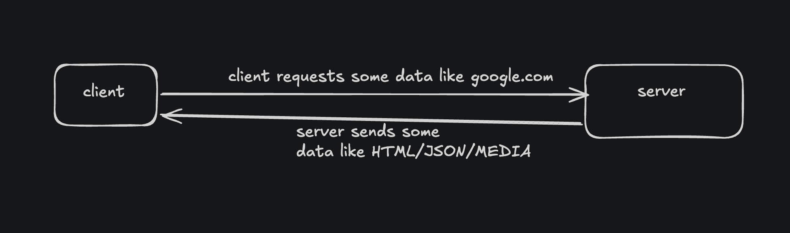

Requirement: 
    - Basic understanding of java
    - Basic understanding of Os like process , Thread , memory , sockets

What will you understand:
    - What is Blocking io, how it works and what is limitations of it.

Brief of how web works:
    